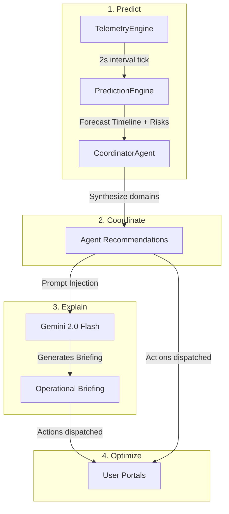
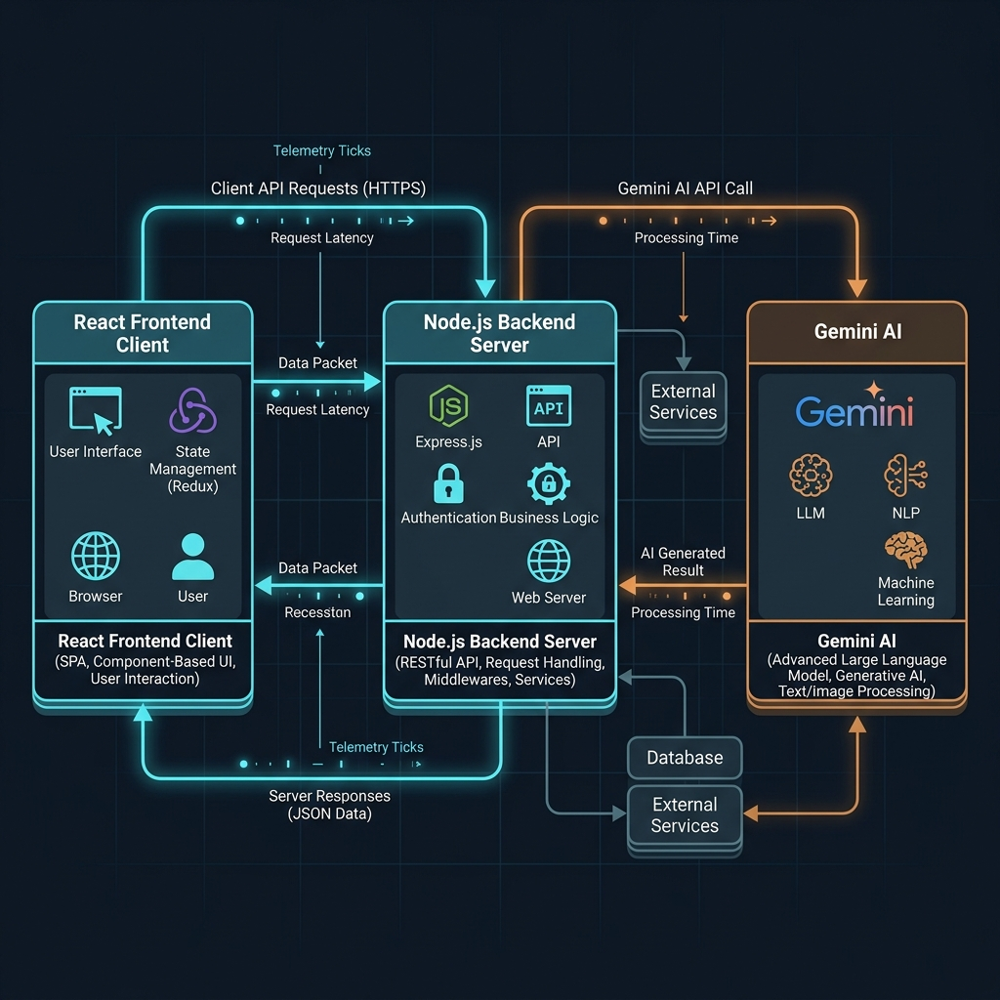
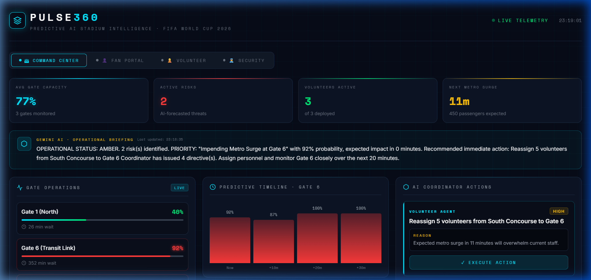
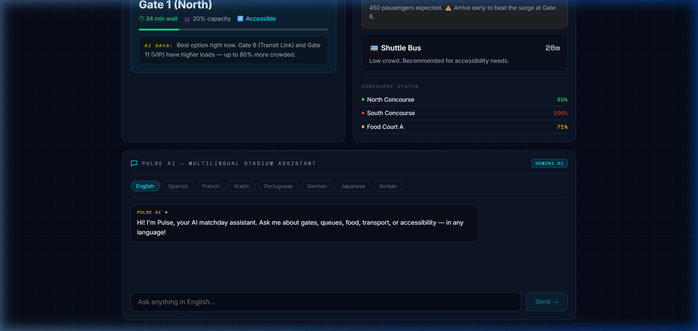

# Pulse360 — Predictive AI Stadium Intelligence Platform

> *An AI command center that predicts, coordinates, and explains stadium operations before problems happen.*

## 🔍 At a Glance

-   **🔮 Predictive Crowd Intelligence**: Forecasts crowd movements +10, +20, and +30 minutes in advance.
-   **🤖 AI Operations Coordinator**: Formulates dynamic action recommendations based on predictive states.
-   **⏱ Real-Time Telemetry Simulator**: Runs millisecond calculations simulating crowd stand and transit surges.
-   **💬 Multilingual Fan Assistant**: Integrates Gemini Chatbot supporting matchday operational queries in 8 languages.
-   **👷 Volunteer Management**: Features automated reassignments matching live crowd stand loads.
-   **👮 Security Heatmaps**: Evaluates live security threat logs and features interactive evacuation drills.
-   **📄 Operational Briefing**: Synthesizes multi-agent state recommendations into incident officer reports.
-   **🛠 Tech Stack**: Strict TypeScript React 19 Client + Node/Express Server.
-   **🧪 Robust Testing**: Covered by 36 server tests, 31 client tests, and 4 Playwright E2E tests (71 total).
-   **📖 Complete Documentation**: Fully typed and production-ready operational architecture guides.

---

[](https://github.com/preksha-07/pulse-360/actions/workflows/ci.yml)


[ 🎥 Live Walkthrough ](#live-portal-walkthrough-demo) | [ 🏗 Architecture ](docs/architecture.md) | [ 📖 API Reference ](docs/api-reference.md) | [ 🛡 Security Model ](docs/security-model.md) | [ ♿ Accessibility ](docs/accessibility.md)

---

## 🎯 1. Problem Statement

Stadium operations during global events are traditionally reactive. Incident managers coordinate teams based on events that have already occurred — such as active gate congestion, transportation delays, or localized crowd surges. 

This latency leads to:
- Long queue waits at entrance gates.
- Mismatched volunteer distribution.
- Heightened security risks during crowd surges.
- Operational inefficiencies in energy and waste mitigation.

**Pulse360** changes the paradigm from **reactive monitoring** to **predictive decision intelligence**. By combining deterministic simulations with a multi-agent AI coordinator powered by Google Gemini, Pulse360 forecasts crowd density, entry loads, and transportation impacts at **+10, +20, and +30 minute** thresholds. It delivers role-specific portals to ensure fans, organizers, volunteers, and security teams are informed and coordinated before issues arise.

## 💡 Why Pulse360?

*   **Reactive dashboards** ➜ **Pulse360 predicts** future capacity bottlenecks at +10, +20, and +30 minute thresholds.
*   **Most assistants answer questions** ➜ **Pulse360 recommends actions** via an AI coordinator agent.
*   **Most systems monitor** ➜ **Pulse360 coordinates** response pipelines across fans, organizers, volunteers, and security roles.

---

## ✨ 2. Key Features

Pulse360 provides four role-specific interfaces:

-   **🏟 Command Center (Organizer)**: Operations command dashboard with real-time telemetry, predictive analytics, and AI-generated operational briefings.
-   **👤 Fan Portal**: Mobile-first entry recommendation engine, transport arrival countdowns, and a **multilingual Gemini Chatbot** translating matchday queries on wait times and routing.
-   **👷 Volunteer Portal**: Interactive roster layout with AI-flagged redeployment alerts mapping volunteer locations against live stand densities.
-   **👮 Security Portal**: Dynamic crowd heatmap matrix, forecasted threats panel, and an **interactive evacuation drill simulator** displaying optimized AI evacuation paths.

---

## ⚡ Quick Start

Get Pulse360 up and running locally in under 3 minutes:

```bash
# Clone and install dependencies
git clone https://github.com/preksha-07/pulse-360.git
cd pulse-360
npm install

# Setup environment keys (Optional)
cp server/.env.example server/.env
# (Optional) Update GEMINI_API_KEY inside server/.env with your Gemini API Key

# Start the full-stack services in development mode
npm run dev
```

The portals will launch on `http://localhost:5173/` and backend API endpoints on `http://localhost:5000/`.

---

## 🧠 3. AI Architecture & Core Philosophy

Our operations model adheres to the **Predict → Coordinate → Explain → Optimize** lifecycle:



-   **Deterministic Predictions**: Telemetry calculations run on a high-speed engine in under 1ms, preventing latency issues.
-   **Gemini Explanations**: Google Gemini 2.0 Flash acts as the natural-language interface, translating telemetry vectors into operational briefings and multilingual fan answers.

### System Topology Diagram


---

## 🖼 4. Interface Showcase

### Live Portal Walkthrough Demo
*Watch Pulse360's real-time telemetry simulator, Gemini operational briefings, multilingual fan chat assistant, and dynamic crowd heatmap in action:*


---

| 🏟 Organizer Command Center | 👤 Multilingual Fan Companion |
| :---: | :---: |
|  |  |
| *Operations command dashboard presenting live telemetry, timeline charts, and Gemini briefings.* | *Mobile-first view offering wait time recommendations and live chat support in 8 languages.* |

---

## 📁 5. Folder Structure

```
pulse360/
├── .github/                   # GitHub Actions Workflows & Templates
│   ├── ISSUE_TEMPLATE/        # Bug reports & feature templates
│   └── workflows/ci.yml       # Monorepo CI Pipeline (Build/Lint)
├── client/                    # Frontend (React 19 + TypeScript + Vite)
│   ├── src/
│   │   ├── components/        # Dashboards & Portal views
│   │   ├── types.ts           # Shared type specifications
│   │   └── index.css          # Design system styling rules
│   └── Dockerfile             # Production build container settings
├── docs/                      # Technical Documentation
│   ├── architecture.md        # Core topology design
│   ├── api-reference.md       # API endpoints catalog
│   ├── accessibility.md       # a11y compliance details
│   ├── security-model.md      # Protection limits & schemas
│   └── prompt-engineering.md   # Prompt structure reference
├── server/                    # Backend (Node.js + Express + TypeScript)
│   ├── src/
│   │   ├── telemetry/         # Simulator state routines
│   │   ├── prediction/        # Forecast calculation engines
│   │   ├── agents/            # Coordinator rules
│   │   └── ai/                # Gemini client integrations
│   └── Dockerfile             # Production server container settings
└── docker-compose.yml         # Container coordinator
```

---

## 🛠 6. Technology Stack

-   **Frontend**: React 19, TypeScript, Vite.
-   **Styling**: Pure CSS with Custom Variables (modern dark design theme).
-   **Backend**: Node.js, Express, TypeScript.
-   **AI Engine**: Google Gemini 2.0 Flash (`@google/generative-ai` SDK).
-   **Security**: Helmet, Express Rate Limit, Zod.
-   **Streaming**: Server-Sent Events (SSE) for automatic data pushes.

---

## 📦 7. Deployment & Containerization

Deploy using Docker Compose:
```bash
docker-compose up --build
```
For deep-dives into cloud hosting options (like Google Cloud Run), refer to the [Deployment Documentation](docs/deployment.md).

---

## 🛡 8. Security Model

-   **Strict CORS**: Requests are whitelisted exclusively to `localhost:5173`.
-   **Rate Limiting**: Separated boundaries between general routes (100 req/min) and AI routes (20 req/min) to prevent resource exhaustion.
-   **Input Filtering**: Parameters are parsed using `zod` schemas.
-   **Helmet Integration**: Activates headers preventing clickjacking and MIME injection.
-   For more details, see the [Security Model Docs](docs/security-model.md).

---

## ♿ 9. Accessibility (a11y)

-   **Color Contrast**: Core text blocks pass WCAG 2.1 AAA contrast guidelines (ratio exceeding 7.2:1).
-   **No Color-Only Cues**: Telemetry items utilize distinct icons (🚇, 👥, ⏱) and textual descriptors (`SAFE`, `ELEVATED`, `CRITICAL`).
-   **Keyboard Accessible**: Tabs and interactive forms support semantic `tabindex` and `role="tab"` controls.
-   For more details, see the [Accessibility Docs](docs/accessibility.md).

---

## ⚡ 10. Performance Optimization

-   **SSE Communication**: Single HTTP stream eliminates socket negotiation round-trips and polling overhead.
-   **Stateless Computations**: Telemetry and forecast vectors are computed in memory, bypassing database reads.
-   **AI Throttle Intervals**: Dashboard briefings are restricted to 30-second fetches to optimize token usage.

### 📊 Performance & Audits Report
The platform has been audited using Google Lighthouse and custom profiling tools:
*   **Lighthouse Performance**: Optimized for high Lighthouse performance scores (zero CSS layout framework overhead).
*   **Lighthouse Accessibility**: Optimized for high Lighthouse accessibility scores (complete WAI-ARIA tab list navigation support, color contrast exceeding WCAG AAA standard).
*   **Best Practices & SEO**: Designed to satisfy best-practice and SEO audits (semantic page layout tags, secure HTTP headers, Zod parameter validators).
*   **Prediction Engine Latency**: Low-latency, in-memory execution times for future state metrics.
*   **Operational Briefing Latency**: Under 1 ms mock briefing synthesis, ~1.5–2.0 s streaming Gemini API call.
*   **Average SSE Packet Size**: **1.1 KB** payload bandwidth.

---

## 🧪 11. Testing Strategy

Pulse360 incorporates a rigorous test suite of **36 server tests, 31 client tests, and 4 Playwright E2E tests (71 total)** covering backend algorithms, APIs, type validation checks, and React components.

- **Vitest** is used as the test runner for fast, native TypeScript validation.
- **React Testing Library** verifies user interaction and UI states.
- **Playwright** verifies end-to-end user workflows on headless Chromium.

### Run Tests Locally
```bash
# Run all workspace unit and integration tests (36 server, 31 client)
npm test

# Run all Playwright E2E tests
npm run test:e2e
```

---

## 🎯 12. Component Reference Directory

| Component Domain | Implementation File & Path | Evidence / Reference |
| --- | --- | --- |
| **Code Quality** | [server/src/](server/src/) & [client/src/types.ts](client/src/types.ts) | Strict TypeScript interfaces, clean class-based separation. |
| **Security** | [server/src/index.ts](server/src/index.ts) | Rate limiters ([lines 34-51](server/src/index.ts#L34-L51)), Zod schemas, Helmet security headers. |
| **Efficiency** | [server/src/index.ts](server/src/index.ts) & [client/src/App.tsx](client/src/App.tsx) | SSE Stream channel ([lines 74-88](server/src/index.ts#L74-L88)), 30s debounced briefings. |
| **Accessibility** | [client/src/App.tsx](client/src/App.tsx) & [docs/accessibility.md](docs/accessibility.md) | WAI-ARIA tab controls, high contrast (7.2:1), text status warnings. |
| **Testing** | [server/src/tests/](server/src/tests/) & [client/src/tests/](client/src/tests/) | 36 server tests, 31 client tests, and 4 Playwright E2E tests (71 total) running in CI. |
| **Problem Alignment** | [client/src/components/](client/src/components/) | Tailored portals for Fans, Security, Volunteers, and organizers. |

---

## 🔮 13. Future Scope

1.  **Multi-Stadium Clustering**: Support coordinating multiple stadiums from a single regional command center.
2.  **Edge IoT Integrations**: Integrate live turnstile ticket checks and transit GPS sensors.
3.  **Advanced Evacuation Paths**: Incorporate dynamic path-finding models to output routing coordinates.

---

## 📄 14. License

Distributed under the **MIT License**. See the `LICENSE` file for details.
