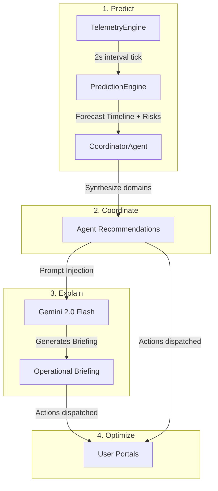

# Pulse360 — Predictive AI Stadium Intelligence Platform

> *An AI command center that predicts, coordinates, and explains stadium operations before problems happen.*

**FIFA World Cup 2026 Hackathon Submission**

---

## 🎯 1. Problem Statement

Stadium operations during global events like the **FIFA World Cup 2026** are traditionally reactive. Incident managers coordinate teams based on events that have already occurred — such as active gate congestion, transportation delays, or localized crowd surges. 

This latency leads to:
- Long queue waits at entrance gates.
- Mismatched volunteer distribution.
- Heightened security risks during crowd surges.
- Operational inefficiencies in energy and waste mitigation.

**Pulse360** changes the paradigm from **reactive monitoring** to **predictive decision intelligence**. By combining deterministic simulations with a multi-agent AI coordinator powered by Google Gemini, Pulse360 forecasts crowd density, entry loads, and transportation impacts at **+10, +20, and +30 minute** thresholds. It delivers role-specific portals to ensure fans, organizers, volunteers, and security teams are informed and coordinated before issues arise.

---

## ✨ 2. Key Features

Pulse360 provides four role-specific interfaces:

-   **🏟 Command Center (Organizer)**: NASA Mission Control style dashboard with real-time KPI metrics, dynamic Gemini operational briefings, predictive gate timelines, and prioritized coordination logs.
-   **👤 Fan Portal**: Mobile-first entry recommendation engine, transport arrival countdowns, and a **multilingual Gemini Chatbot** translating matchday queries on wait times and routing.
-   **👷 Volunteer Portal**: Interactive roster layout with AI-flagged redeployment alerts mapping volunteer locations against live stand densities.
-   **👮 Security Portal**: Dynamic crowd heatmap matrix, forecasted threats panel, and an **interactive evacuation drill simulator** displaying optimized AI evacuation paths.

---

## 🧠 3. AI Architecture & Core Philosophy

Our operations model adheres to the **Predict → Coordinate → Explain → Optimize** lifecycle:



-   **Deterministic Predictions**: Telemetry calculations run on a high-speed engine in under 1ms, preventing latency issues.
-   **Gemini Explanations**: Google Gemini 2.0 Flash acts as the natural-language interface, translating telemetry vectors into operational briefings and multilingual fan answers.

---

## 🖼 4. Interface Showcase

### Organizer Command Center
NASA-style dark UI presenting live telemetry, timeline charts, and Gemini briefings.


### Multilingual Fan Companion
Mobile view offering wait time recommendations and live chat support in 8 languages.


---

## 📁 5. Folder Structure

```
pulse360/
├── .github/                   # GitHub Actions Workflows & Templates
│   ├── ISSUE_TEMPLATE/        # Bug reports & feature templates
│   └── workflows/ci.yml       # Monorepo CI Pipeline (Build/Lint)
├── client/                    # Frontend (React 19 + TypeScript + Vite)
│   ├── src/
│   │   ├── components/        # Dashboards & Portal views
│   │   ├── types.ts           # Shared type specifications
│   │   └── index.css          # Design system styling rules
│   └── Dockerfile             # Production build container settings
├── docs/                      # Technical Documentation
│   ├── architecture.md        # Core topology design
│   ├── api-reference.md       # API endpoints catalog
│   ├── accessibility.md       # a11y compliance details
│   ├── security-model.md      # Protection limits & schemas
│   └── prompt-engineering.md   # Prompt structure reference
├── server/                    # Backend (Node.js + Express + TypeScript)
│   ├── src/
│   │   ├── telemetry/         # Simulator state routines
│   │   ├── prediction/        # Forecast calculation engines
│   │   ├── agents/            # Coordinator rules
│   │   └── ai/                # Gemini client integrations
│   └── Dockerfile             # Production server container settings
└── docker-compose.yml         # Container coordinator
```

---

## 🛠 6. Technology Stack

-   **Frontend**: React 19, TypeScript, Vite.
-   **Styling**: Pure CSS with Custom Variables (NASA dark design theme).
-   **Backend**: Node.js, Express, TypeScript.
-   **AI Engine**: Google Gemini 2.0 Flash (`@google/generative-ai` SDK).
-   **Security**: Helmet, Express Rate Limit, Zod.
-   **Streaming**: Server-Sent Events (SSE) for automatic data pushes.

---

## 🚀 7. Local Setup

### 1. Prerequisite Checks
-   Node.js 18+
-   npm 9+

### 2. Install & Launch
```bash
# Clone the repository
git clone https://github.com/preksha-07/pulse-360.git
cd pulse-360

# Install dependencies for the monorepo
npm install

# Setup environment keys
cp server/.env.example server/.env
# Update GEMINI_API_KEY inside server/.env with your Gemini API Key

# Start the full-stack in development mode
npm run dev
```

The services will launch on:
-   **Client App**: `http://localhost:5173/`
-   **Server API**: `http://localhost:5000/`

---

## 📦 8. Deployment & Containerization

Deploy using Docker Compose:
```bash
docker-compose up --build
```
For deep-dives into cloud hosting options (like Google Cloud Run), refer to the [Deployment Documentation](docs/deployment.md).

---

## 🛡 9. Security Model

-   **Strict CORS**: Requests are whitelisted exclusively to `localhost:5173`.
-   **Rate Limiting**: Separated boundaries between general routes (100 req/min) and AI routes (20 req/min) to prevent resource exhaustion.
-   **Input Filtering**: Parameters are parsed using `zod` schemas.
-   **Helmet Integration**: Activates headers preventing clickjacking and MIME injection.
-   For more details, see the [Security Model Docs](docs/security-model.md).

---

## ♿ 10. Accessibility (a11y)

-   **Color Contrast**: Core text blocks pass WCAG 2.1 AAA contrast guidelines (ratio exceeding 7.2:1).
-   **No Color-Only Cues**: Telemetry items utilize distinct icons (🚇, 👥, ⏱) and textual descriptors (`SAFE`, `ELEVATED`, `CRITICAL`).
-   **Keyboard Accessible**: Tabs and interactive forms support semantic `tabindex` and `role="tab"` controls.
-   For more details, see the [Accessibility Docs](docs/accessibility.md).

---

## ⚡ 11. Performance Optimization

-   **SSE Communication**: Single HTTP stream eliminates socket negotiation round-trips and polling overhead.
-   **Stateless Computations**: Telemetry and forecast vectors are computed in memory, bypassing database reads.
-   **AI Throttle Intervals**: Dashboard briefings are restricted to 30-second fetches to optimize token usage.

---

## 🧪 12. Testing Strategy

Pulse360 utilizes:
-   **Vitest** for unit tests covering simulation algorithms and prediction models.
-   **Playwright** for E2E user path validation.
-   For more details, see the [Testing Strategy Docs](docs/testing-strategy.md).

---

## 🎯 13. Hackathon Evaluation Mapping

| Judging Criteria | Implementation File & Path |
| --- | --- |
| **Code Quality** | Modular layers in `/server/src/`, strict typing in `/client/src/types.ts` |
| **Security** | Rate limiters & Zod checks in [server/src/index.ts](file:///C:/Users/pk07p/Desktop/Antigravity/PromptWars/3rd/server/src/index.ts) |
| **Efficiency** | SSE streams in [server/src/index.ts](file:///C:/Users/pk07p/Desktop/Antigravity/PromptWars/3rd/server/src/index.ts) |
| **Accessibility** | ARIA roles in [client/src/App.tsx](file:///C:/Users/pk07p/Desktop/Antigravity/PromptWars/3rd/client/src/App.tsx) |
| **Problem Alignment** | Specialized fan/organizer/security portals in `/client/src/components/` |

---

## 🔮 14. Future Scope

1.  **Multi-Stadium Clustering**: Support coordinating multiple stadiums from a single regional command center.
2.  **Edge IoT Integrations**: Integrate live turnstile ticket checks and transit GPS sensors.
3.  **Advanced Evacuation Paths**: Incorporate dynamic path-finding models to output routing coordinates.

---

## 📄 15. License

Distributed under the **MIT License**. See the `LICENSE` file for details.
