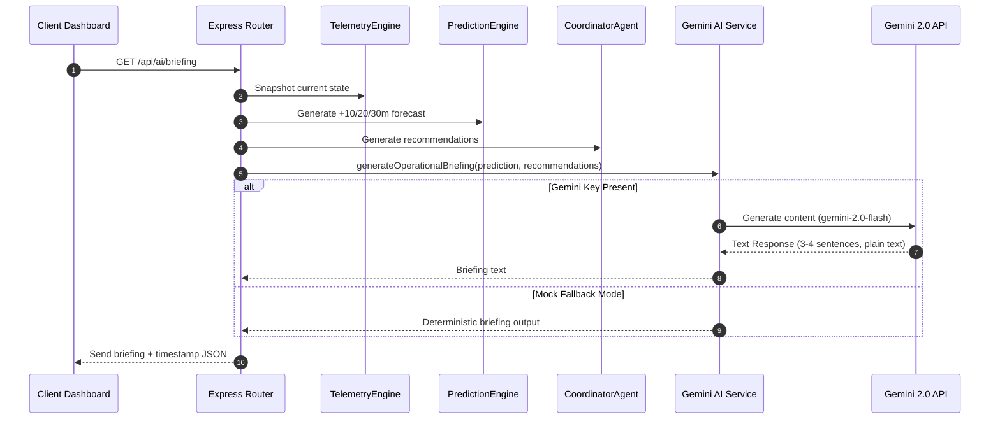
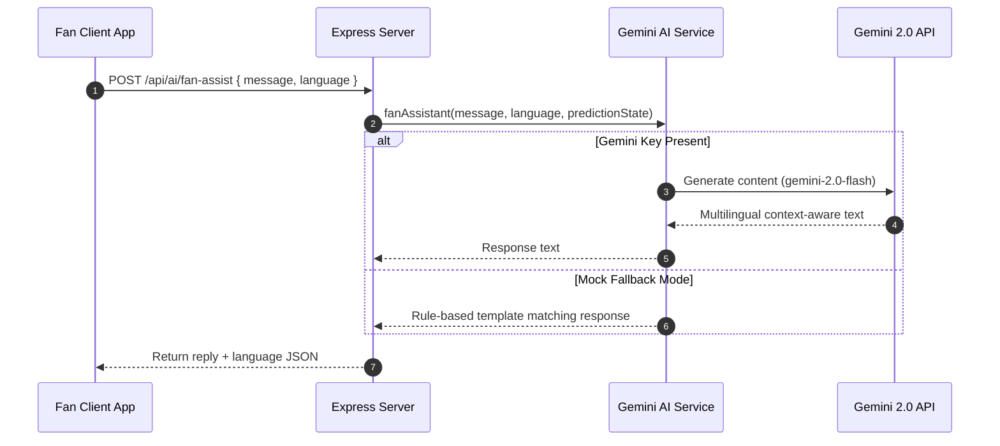

# Generative AI Workflows — Pulse360

This document outlines the workflow, API calls, and logic supporting the integration of the Google Gemini 2.0 Flash model in Pulse360.

---

## 1. Operational Briefing Workflow

The Organizer dashboard displays a dynamically updated Operational Briefing in the Command Center. This summary is fetched every 30 seconds to describe current security threats, transportation surges, and coordinator directives.



### AI Operational Prompt Definition
```typescript
const prompt = `You are Pulse360, an AI stadium operations intelligence system for the FIFA World Cup 2026. Generate a concise operational briefing (3-4 sentences, no markdown) based on this data:
- Active risks: ${riskCount}
- Top risk: ${topRisk ? `"${topRisk.title}" (${topRisk.probabilityPercent}% probability, impact in ${topRisk.timeToImpactMinutes} min)` : 'None'}
- Reasoning: ${topRisk?.reasoning?.join('; ') || 'N/A'}
- Recommended actions: ${recommendations.map(r => r.action).join('; ') || 'None'}
Write as a real operations officer reporting to the stadium director. Be specific and action-oriented.`;
```

---

## 2. Multilingual Fan Assistant Workflow

The Fan Portal includes a conversational AI interface. Users can ask questions in multiple languages regarding gate wait times, restrooms, concessions, transport delays, and general match logistics.



### Context Injected Prompt
```typescript
const prompt = `You are a helpful FIFA World Cup 2026 stadium assistant named Pulse. Answer the fan's question in ${language}. Be friendly, brief (2-3 sentences), and use the live stadium data below.

Live data:
- Best gate: ${bestGate?.name} (${bestGate?.capacityPercent}% full, ${bestGate?.queueTimeMinutes} min wait)
- Next metro: ${Math.floor(nextMetro?.nextArrivalMinutes || 0)} min (${nextMetro?.expectedPassengers} passengers)
- Crowd risks: ${prediction.risks.length > 0 ? prediction.risks.map(r => r.title).join(', ') : 'None'}

Fan question: "${userMessage}"`;
```

---

## 3. Mock Fallback Mode Architecture

To guarantee high reliability during production deployments, Pulse360 includes a complete fallback engine.

- **Check Condition**: Checked at runtime if `GEMINI_API_KEY` is undefined or equals its default placeholder `your_gemini_api_key_here`.
- **Briefing Fallback**: Instantly generates operational briefings using deterministic template interpolation based on live risks:
  ```typescript
  if (riskCount === 0) {
    return `OPERATIONAL STATUS: GREEN. All stadium systems are within normal parameters...`;
  }
  return `OPERATIONAL STATUS: AMBER. ${riskCount} risk(s) identified...`;
  ```
- **Chat Fallback**: Uses regex keyword matching (`gate`, `metro`, `train`, `restroom`, `food`, `accessibility`) to yield context-aware metrics corresponding to the current state of the database simulation.
