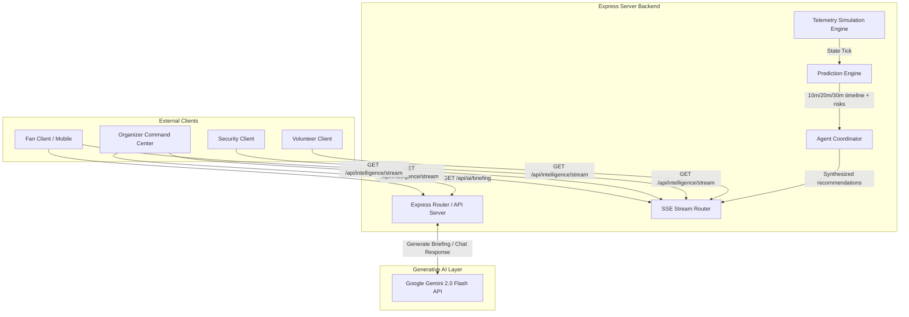
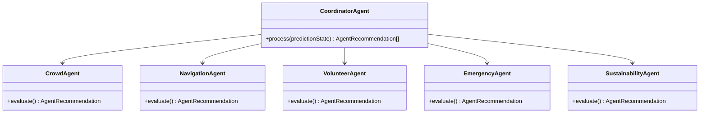

# Architecture Overview — Pulse360

This document describes the technical architecture, data flow, and components of the Pulse360 Predictive AI Stadium Intelligence platform.

---

## 1. System Topology

Pulse360 is built as a modular monorepo containing a React frontend and an Express backend. Real-time updates are pushed to the client using **Server-Sent Events (SSE)**, which establishes a persistent, memory-efficient pipeline for streaming telemetry, future predictions, and coordinated recommendations.

---

## 2. Telemetry Simulation Engine (`server/src/telemetry`)

The `TelemetryEngine` acts as a state machine simulating active stadium nodes during a matchday. 
- **Interval**: Mutates state and ticks every 2 seconds.
- **Data Models**:
  - **Gates**: Capacity, current queue times, and accessibility status.
  - **Zones**: Crowding metrics in concourses, stands, and amenities.
  - **Transport**: Metro and bus arrivals, passenger counts, and countdowns.
  - **Sustainability**: Live energy usage (kW), water consumption (liters), and waste generation (kg).
  - **Volunteers**: Individual roster names, current zone locations, and status (active, reassigning, break).

---

## 3. Prediction Engine (`server/src/prediction`)

The `PredictionEngine` transforms raw telemetry data into prospective state vectors. It forecasts stadium conditions at **+10, +20, and +30 minute** offsets.

### Prediction Logic
- **Crowd Interpolation**: Interpolates path capacity over time based on transport countdown schedules.
- **Event-Driven Surges**: Simulates high-density load propagation (e.g. when a metro train arrives, a future spike is propagated to Gate 6).
- **Risk Assessment**: Generates structural risk warnings with computed probability thresholds when densities are projected to exceed limits.

---

## 4. Multi-Agent Coordinator Layer (`server/src/agents`)

The coordinator processes the `PredictionState` and triggers action plans. It simulates five distinct operational agents:

- **Crowd Agent**: Monitors gate overflow risks.
- **Navigation Agent**: Directs entry distribution.
- **Volunteer Agent**: Redeploys personnel to overloaded sectors.
- **Emergency Agent**: Triggers evacuation routines.
- **Sustainability Agent**: Implements energy-saving or waste-mitigation measures.

All actions are synthesized, assigned a priority level (`low`, `medium`, `high`, `critical`), and combined with explicit operational reasoning.

---

## 5. Client Component Architecture

The React client exposes role-specific portal views that consume the unified Server-Sent Event stream:

- **`Dashboard.tsx` (Command Center)**: Evaluates live KPIs, tracks the timeline chart, and renders the operational briefing.
- **`FanPortal.tsx` (Fan Companion)**: Shows personalized gates, transport details, and houses the multilingual Gemini chatbot.
- **`VolunteerPortal.tsx` (Task Manager)**: Handles task assignments and live roster shifts.
- **`SecurityPortal.tsx` (Threat Panel)**: Shows heatmaps, live risks, and controls evacuation simulators.
